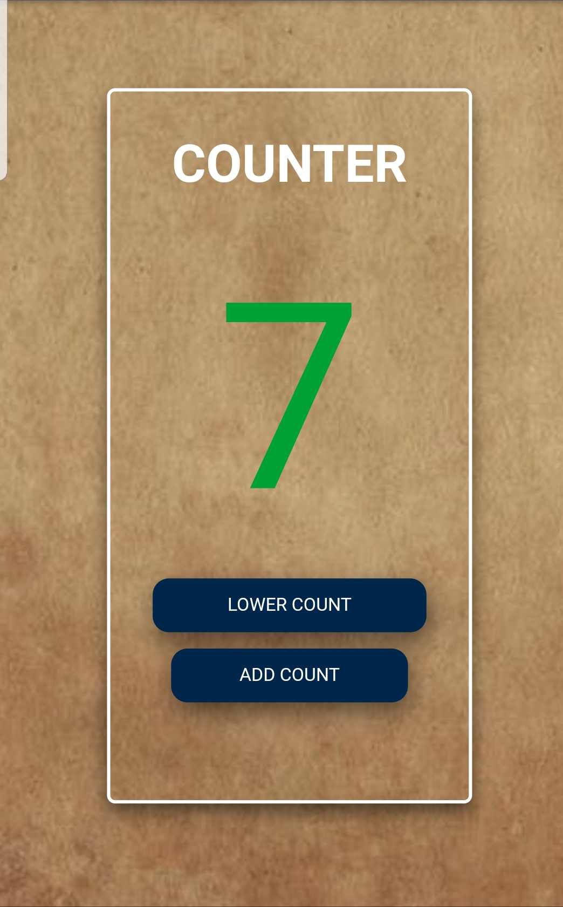

# Javascript-Counter-App
A counter app with a set minimum and maximum value.

## Side Hustle internship: My solution to Task 3.

### Description:
A counter made from scratch using HTMl, CSS and Javascript. It has a minimum value of 0 and a maximum value of 50.

### How it works:
When the **Add Count button** is clicked on, the counter value increases by one. The value will continue to increase until it reaches its maximum value of 50. At this point, it stops increasing even if the Add Count button is clicked on.
On the other hand, when the **Lower Count button** is clicked on, the counter value reduces by one. This continues until it reaches its minimum value of zero, then it stops.

### Technology Used:
- **HTML5** to structure the page.
- **CSS** for styling and responsiveness.
-**Javascript** to give functionality using addEvenListener and the conditional "if" statement to set the maximum and minimum values.

### Links:

